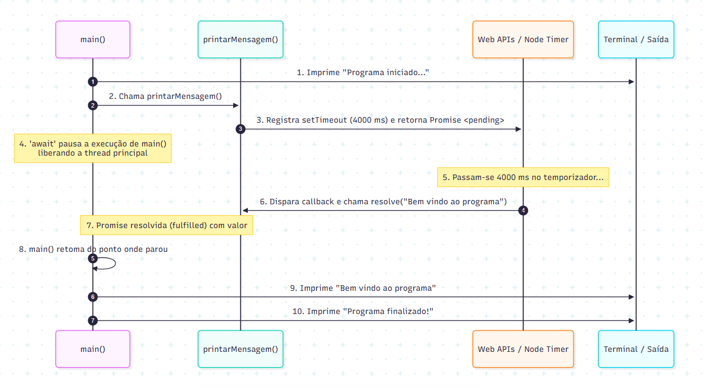

# Entendendo o Ciclo de Execução: `async/await` e `Promise`

Este documento explica detalhadamente o ciclo de vida, a ordem de execução e o comportamento assíncrono do código presente em  `asyncAwayt.ts`.

---

## 📄 O Código Analisado

```typescript
function printarMensagem(): Promise<string> {
    return new Promise((resolve) => {
        setTimeout(() => {
            resolve("Bem vindo ao programa");
        }, 4000);
    });
}

async function main() {
    console.log("Programa iniciado...");
    const mensagem = await printarMensagem();
    console.log(mensagem);
    console.log("Programa finalizado!");
}

main();
```

---

## 🔄 Fluxo de Execução Visual



---

## ⏱️ Linha do Tempo Passo a Passo

| Tempo | O que acontece | Saída no Console | Estado da Promise |
| :--- | :--- | :--- | :--- |
| **0 ms** | `main()` é invocada | — | — |
| **0 ms** | Executa `console.log("Programa iniciado...")` de forma síncrona | `Programa iniciado...` | — |
| **0 ms** | Invoca `printarMensagem()`, criando a `Promise` e iniciando o `setTimeout` de 4s | — | `Pending` (Pendente) |
| **0 ms** | O operador `await` pausa o restante da função `main()` até a resolução da `Promise` | — | `Pending` |
| **0 ms a 4000 ms** | A thread principal não fica travada; o temporizador roda em segundo plano | *(aguardando)* | `Pending` |
| **4000 ms** | O tempo expira, o callback do timer executa `resolve("Bem vindo ao programa")` | — | `Fulfilled` (Resolvida) |
| **4000 ms** | `main()` retoma. A variável `mensagem` recebe o valor `"Bem vindo ao programa"` | — | Resolvida |
| **4000 ms** | Executa `console.log(mensagem)` | `Bem vindo ao programa` | — |
| **4000 ms** | Executa `console.log("Programa finalizado!")` | `Programa finalizado!` | — |

---

## 🧠 Conceitos-Chave do Ciclo

### 1. O que é uma `Promise`?
Uma **Promise** (promessa) é um objeto que representa um valor que pode estar disponível agora, no futuro ou nunca. Ela possui três estados:
- **`pending` (pendente):** Estado inicial, ainda não foi resolvida nem rejeitada.
- **`fulfilled` (resolvida):** Operação concluída com sucesso (`resolve(valor)`).
- **`rejected` (rejeitada):** Operação falhou (`reject(erro)`).

### 2. O papel do `setTimeout`
O `setTimeout` delega a contagem de tempo para a API do ambiente (Node.js/Navegador), permitindo que o JavaScript continue executando outras tarefas sem travar a CPU.

### 3. O papel do `async` e `await`
- `async`: Declara que a função sempre retorna uma Promise.
- `await`: Pausa **apenas o interior da função assíncrona** até que a Promise resolva. O restante da aplicação continua livre (não bloqueia a thread principal).

---

## 🖥️ Saída Final no Terminal

```text
Programa iniciado...
(espera de 4 segundos...)
Bem vindo ao programa
Programa finalizado!
```
